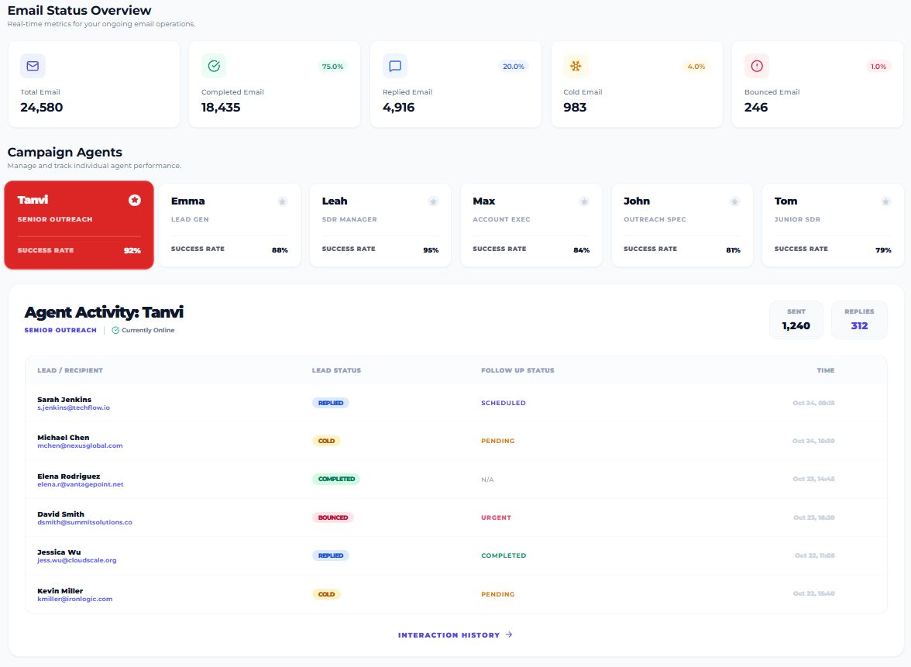

# Run and deploy your AI Studio app

This contains everything you need to run your app locally.

View your app in AI Studio: https://ai.studio/apps/drive/178UdPNOous8Ic0cRLEI0I_AxJ2IKbkVm

## Run Locally

**Prerequisites:**  Node.js

1. Install dependencies:
   `npm install`
2. Set the `GEMINI_API_KEY` in [.env.local](.env.local) to your Gemini API key
3. Run the app:
   `npm run dev`

   # 📧 MailPulse – Email Analytics Pro Dashboard

A modern **email outreach analytics dashboard** designed to monitor campaign performance, agent productivity, and real-time email status at scale.

---

## 🚀 Overview

**MailPulse Analytics Pro** provides a centralized view of email campaign health, agent success rates, and lead activity. It is built for teams running high-volume outreach who need clarity, speed, and accountability.

This dashboard focuses on:
- Real-time performance metrics
- Individual agent tracking
- Lead-level activity visibility

---

## 📊 Key Metrics (Top Section)

The dashboard displays critical email KPIs at a glance:

- **Total Emails Sent** – Overall campaign volume  
- **Completed Emails** – Successfully delivered emails  
- **Replied Emails** – Engagement indicator  
- **Cold Emails** – Leads with no response  
- **Bounced Emails** – Delivery failures  

Each metric includes **percentage indicators** to quickly assess performance trends.

---

## 👥 Campaign Agents

Track individual agent performance with:
- Role designation (Senior Outreach, Lead Gen, SDR, etc.)
- Success rate percentage
- Visual highlight for top performers

This makes performance gaps and standout contributors obvious—no digging required.

---

## 🧠 Agent Activity Panel

Detailed activity tracking for selected agents, including:

- Lead / recipient name and email
- Lead status (Replied, Cold, Completed, Bounced)
- Follow-up status (Scheduled, Pending, Urgent)
- Timestamped activity log
- Sent vs reply counts

This section is optimized for **daily operational review**.

---

## 🧩 Use Cases

- Sales outreach monitoring  
- SDR performance evaluation  
- Campaign health diagnostics  
- Lead follow-up prioritization  
- Team accountability reporting  

---

## 🛠️ Potential Tech Stack (Suggested)

This UI can be backed by:
- **Frontend:** React / Next.js / Tailwind CSS  
- **Backend:** Node.js / Laravel / Django  
- **Database:** PostgreSQL / MySQL  
- **Charts & Metrics:** Recharts / Chart.js  
- **Auth & Roles:** JWT / OAuth  

---

## 📌 Notes

- This repository currently focuses on **UI & analytics structure**
- Backend logic and integrations can be extended as needed
- Designed with scalability and clarity in mind

---

## 📄 License

MIT License — free to use, modify, and distribute.

---

## 🤝 Contributions

Pull requests are welcome.  
For major changes, open an issue first to discuss improvements.

---

**Built for teams that care about results, not guesswork.**

